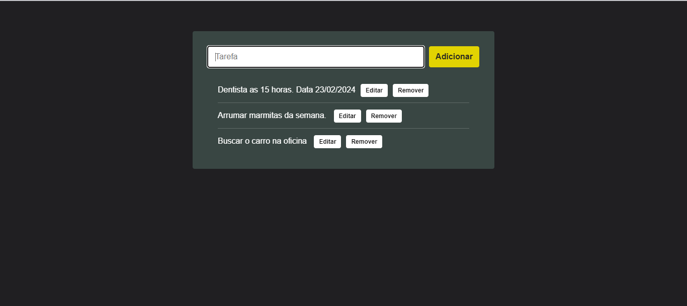

# Projeto crud: 

O usuario podera adicionar , editar , salvar e remover itens na lista. 
## Tecnologias
-Redux saga 
-JavaScritp 
-duck pattern
-material ui 

### Para iniciar o projeto , digite o comando `npm start` no terminal. 

